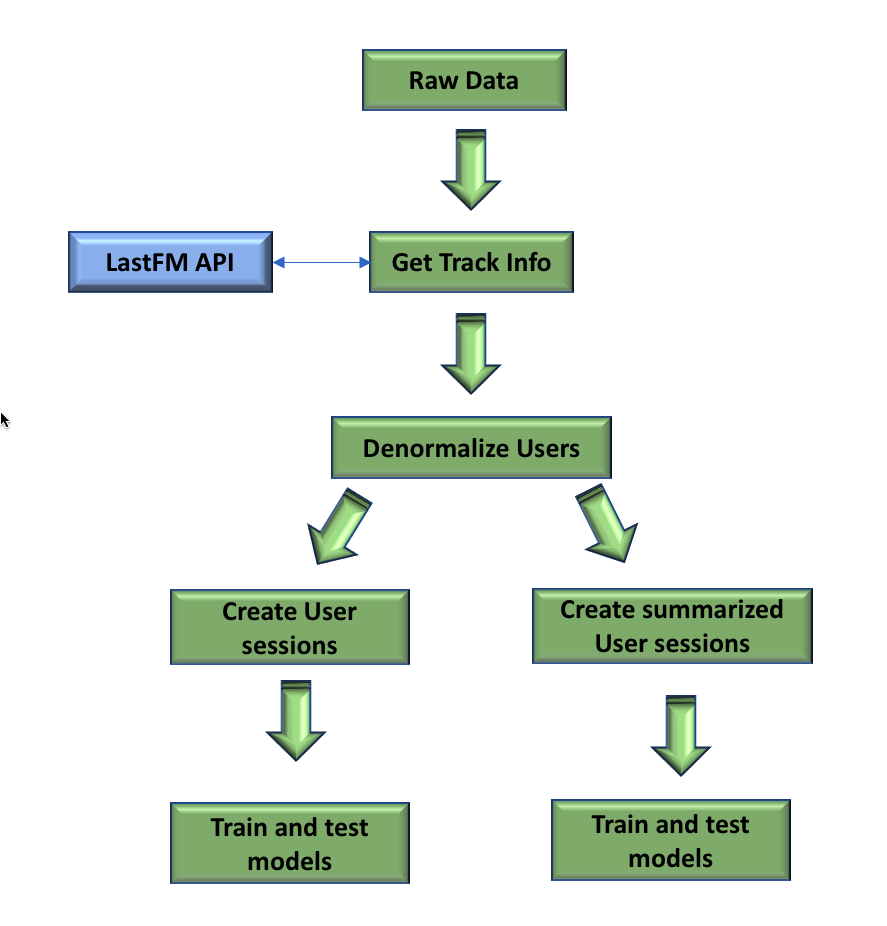

# Session length prediction using sequence to sequence models

## Overview

## Initial data_processing: 

Contains code for data exploration as well as pre-preprocessing

- __STEP 1__ : Execute "1. get_unique_tracks.ipynb" to get unique track information across all users

- STEP 2: Execute "2. get_track_metadata.ipynb" to get track duration and genres using the lastFM TrackInfo API

- STEP 3: Exxecute "3. create_denormalized_users.ipynb" to combine profile,track and session data to create a denormalized view for each user.

	- Output files: final_dir/users/{user_id}/*.csv

	- Outout contains the following per user:
		- user_id
		- timestamp
		- artist_name
		- track_name
		- gender
		- age
		- country
		- registered
		- duration
		- genre

## Baseline model

Code used to get the baseline sequence to sequence model performance 

- STEP 1: Create summarized session details per user. Execute "0. create_util.ipynb" and "1. create_summarized_user_session.ipynb"

	    - Output files: summary_dir/{type}/{user_id}.csv
	    	- type = train\test\validate
	    	- user_id = ID per user

		- Columns per user:
			- timestamp
			- user_id
			- session_id
			- gender
			- age
			- country
			- registered
			- previous_session_length
			- average_session_length
			- current_session_length

- STEP 2: To train and test, execute "2. Train_and_test_model.ipynb". Use the following hyper parameters to test various models:
		a. GRU
		b. LSTM
		c. Layered LSTM
		d. Add dropout to any of the above combinations.

## Baseline model with clusters

- STEP 1: Build session data for analysis. Execute the following to build the data - 0. create_data_utility.ipynb, 1. build_complete_vocab.ipynb, 2. build_session_data.ipynb

	    - Output files: final_dir/{type}/{user_id}.csv
	    	- type = train\test\validate
	    	- user_id = ID per user

		- Columns per user:
			- user_id
			- current_timestamp
			- start_timestamp			
			- session_id
			- previous_session_length
			- average_session_length
			- gender
			- age
			- country
			- registered
			- track_duration
			- times_played
			- artist_name
			- track_name
			- session_length

- STEP 2: Build a user profile for cluster analysis. Execute "3. build_user_profiles.ipynb" to generate user profiles:

	    - Output files: final_dir/user_profile_cluster.csv

		- Columns:
			- user_id
			- gender
			- age
			- country
			- registered
			- top_artist
			- top_track
			- total_sessions
			- average_session_length

- STEP 3: Cluster analysis. Run some cluster analysis to determine what kind  of clustering to use (refer 4. cluster_analysis.ipynb)

- STEP 4: Train and test models with clustering (Refer 5. create_model_utility.ipynb, 6. train_and_test_model.ipynb)

## Dependencies
- Tensorflow
- Keras
- PySpark
- Python 3
- Original Data: http://www.dtic.upf.edu/~ocelma/MusicRecommendationDataset/lastfm-1K.html

