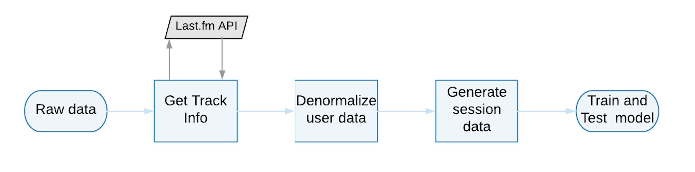
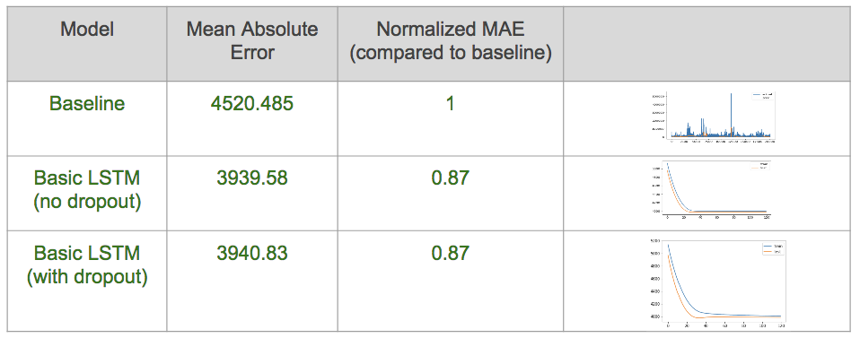
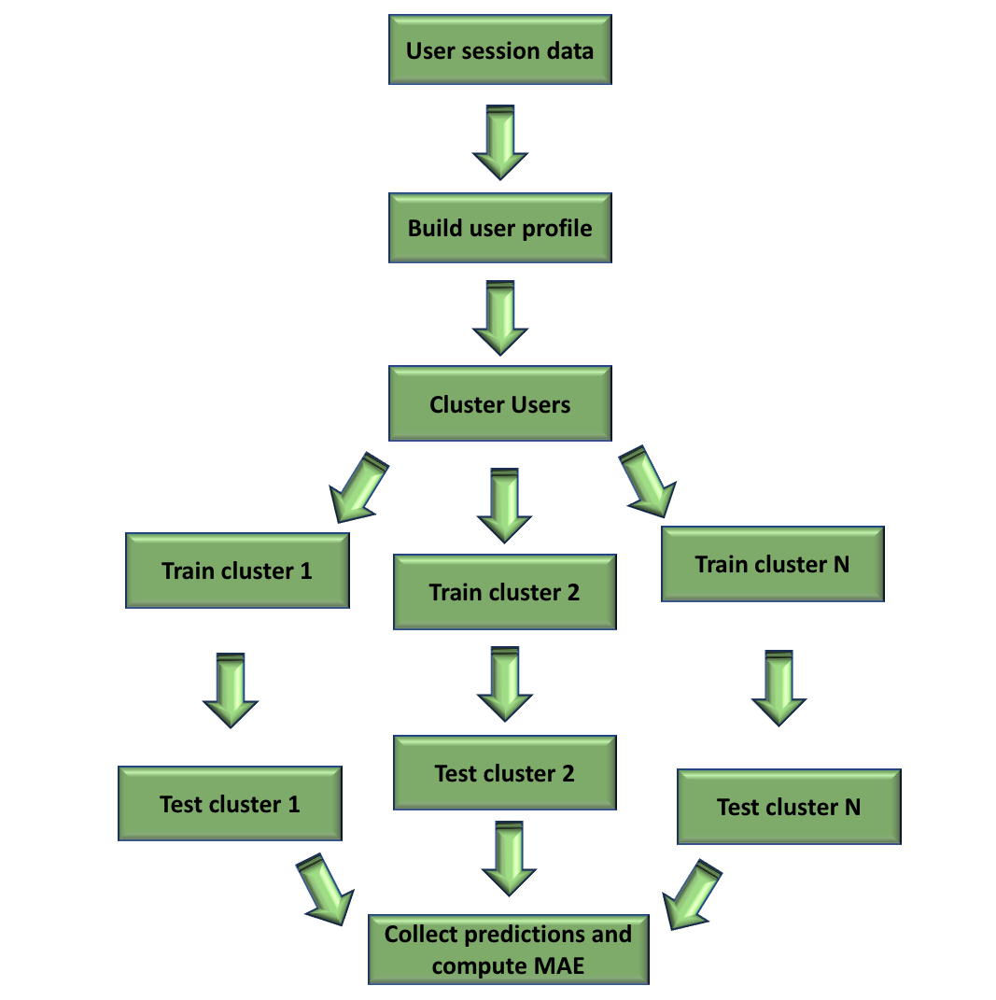

# Session length prediction using sequence to sequence models

## Overview




## Initial data processing (*[data_processing/](https://github.com/UCB-MIDS/w210_lastFM/tree/master/sequence_to_sequence/data_processing)*): 

Contains code for data exploration as well as pre-preprocessing

- __STEP 1__ : Execute *"1. get_unique_tracks.ipynb"* to get unique track information across all users

- __STEP 2__ : Execute *"2. get_track_metadata.ipynb"* to get track duration and genres using the lastFM TrackInfo API

- __STEP 3__ : Execute *"3. create_denormalized_users.ipynb"* to combine profile,track and session data to create a denormalized view for each user.

	```
	- Output files: user_dir/{user_id}/*.csv

	- Outout contains the following per user:
		- user_id     : User ID
		- timestamp   : Current timestamp in UTC
		- artist_name : Name of the artist
		- track_name  : Name of the track being listened to
		- gender      : User gender (m,f,null)
		- age         : Current age of the user (age is computed as age at registration + diff in years between registered date and timestamp)
		- country     : Users country
		- registered  : Data registered
		- duration    : Track duration in seconds
		- genre       : List of Genres associated to the track.
	```

## Baseline model (*[baseline/](https://github.com/UCB-MIDS/w210_lastFM/tree/master/sequence_to_sequence/baseline)*)

Code used to get the baseline sequence to sequence model performance 

- __STEP 1__ : Create summarized session details per user. Execute *"0. create_data_utility.ipynb", "0. create_model_utility.ipynb"* and *"1. create_summarized_user_session.ipynb"*.

	```
	    - Output files: summary_dir/{type}/{user_id}.csv
	    	- type = train\test\validate

		- Columns per user:
			- timestamp               : Milliseconds since epoch
			- user_id                 : Integer representation of user_id
			- session_id              : Unique sequence per user session
			- gender                  : 1 for male, 0 for female, -1 otherwise
			- age                     : integer
			- country                 : integer representation of country
			- registered              : Milliseconds since epoch (or a number for UNK)
			- previous_session_length : Length of previous session in seconds
			- average_session_length  : Average session length of previous sessions for the user in seconds
			- current_session_length  : Current session length in seconds
	```

- __STEP 2__ : To train and test, execute *"2. Train_and_test_model.ipynb"*. Use the following hyper parameters to test various models:

	- __GRU__          : Set "model_lstm" to __False__
	- __LSTM__         : Set "model_lstm" to __True__ and "layered" to __False__
	- __Layered LSTM__ : Set "model_lstm" to __True__ and "layered" to __True__  and "no_layers" to __1__ (Note: Code supports only 2 layers,not more.So set value to 1)
	- __Add dropout__  : Set array of values to "dropout". 
	- *Additional hyperparameter*:
		- "train_file"      : Path to training data
		- "test_file"       : Path to test data
		- "validation_file" : Path to validation data
		- "loss_func"       : Loss function to be used in the Keras model
		- "optimizer"       : Optimizer to be used
		- "hidden_dim"      : Number of hidden dimensions in the network
		- "Batch_size"      : batch size for training
		- "epochs"          : Number of training epochs


### Results




__NOTE__: We see similar results (0.87) for GRU, Layered LSTMS with\without drop out.


## Sequence model with clusters (*[models_with_clusters/](https://github.com/UCB-MIDS/w210_lastFM/tree/master/sequence_to_sequence/models_with_clusters)*)


### Overview





### Steps 


- __STEP 1__: Build session data for analysis. Execute the following to build the data : *0. create_data_utility.ipynb, 1. build_complete_vocab.ipynb, 2. build_session_data.ipynb*

	```
	- Output files: final_dir/{type}/{user_id}.csv
		- type = train\test\validate

	- Columns per user:
		- user_id                 : Integer representation of user_id
		- current_timestamp       : Milliseconds since epoch
		- start_timestamp		  : start time of current session in milliseconds since epoch	
		- session_id              : Unique sequence per user session
		- previous_session_length : Length of previous session in seconds
		- average_session_length  : Average session length of previous sessions for the user in seconds
		- gender                  : 1 for male, 0 for female, -1 otherwise
		- age                     : integer
		- country                 : integer representation of country
		- registered              : Milliseconds since epoch (or a number for UNK)
		- track_duration          : Track length in seconds
		- times_played            : Number of times track is played in one session
		- artist_name             : Integer representation of artist name
		- track_name              : Integer representation of track name
		- session_length          : Current session length in seconds
	```

- __STEP 2__: Build a user profile for cluster analysis. Execute *"3. build_user_profiles.ipynb"* to generate user profiles:
	
	```
	- Output files: final_dir/user_profile_cluster.csv
	- Columns:
		- user_id                 : Integer representation of user_id
		- gender                  : 1 for male, 0 for female, -1 otherwise
		- age                     : integer
		- country                 : integer representation of country
		- registered              : Milliseconds since epoch (or a number for UNK)
		- top_artist              : Artist with highest occurence count across sessions for user in training data
		- top_track               : Track with highest occurence count across sessions for user in training data
		- total_sessions          : Total number of sessions for user  in training data
		- average_session_length  : Average session length for the user in seconds in training data
		- max_session_length      : Max session length for the user in seconds in training data
		- median_session_length   : Median session length for the user in seconds in training data
		- total_session_rows      : Total number of session records present in training data for the user
	```

- __STEP 3__: Cluster analysis. Run some cluster analysis to determine what kind  of clustering to use (*refer 4. cluster_analysis.ipynb and 5. create_model_utility.ipynb*)

	- Use ```util.plot_cluster_elbow()``` to determine the best number of clusters to use. Refer [Elbow Method](https://en.wikipedia.org/wiki/Elbow_method_(clustering)) for more details. 
	- Use ```util.plot_clusters()``` to visualize clusters based on 2 dimensions.
	- Use ```util.silhouette_analysis()``` to visualize a silhouette plot and analyze clusters based on the plot. Refer [Silhouette Method](https://en.wikipedia.org/wiki/Silhouette_(clustering)) for more details.
	- Use ```util.get_baseline_mae()``` to get the baseline scores either in a standardized or raw form. 

- __STEP 4__: Train and test models with clustering (*Refer 5. create_model_utility.ipynb, 6. train_and_test_model.ipynb*).Use the following hyper parameters to test various models:
	
	- __clusters__             : Number of clusters to use
	- __Spectral Clustering__  : To use spectral clustering set "use_spectral_clustering" to __True__
	- __KMeans Clustering__    : To use KMeans, set "use_spectral_clustering" to __False__
	- __cluster dimensions__   : Use "cluster_columns" to specify the column numbers (as a tuple) to be used to determine the clusters.
	- __Standardize data__     : To standardize the data, set "standardize" to __True__, else set it to __False__
	- __mixed standardization__: Setting "mix_std" to __True__ will standardize data if there are less than 200 users in a cluster, otherwise non standardized data will be used.
	- refer [Baseline model Step 2](https://github.com/UCB-MIDS/w210_lastFM/tree/master/sequence_to_sequence#baseline-model-baseline) for details on other hyperparameters.s


### Results (In progress..)

All the below analysis has been done using an LSTM Model

| Method     |  Clusters   |  Normalized MAE  | Standardization    | Dimensions clustered on |
|:-----------|:-----------:|:----------------:|:------------------:|:------------------------|
| KMeans     | 5           | 0.794            | False              | Average session length  |
| KMeans     | 5           | 0.81             | True               | Average session length  |
| KMeans     | 5           | 0.65             | Mixed              | Average session length  |
| Spectral   | 5           | 0.785            | False              | Average session length  |
| Spectral   | 5           | 0.87             | True               | Average session length  |
| Spectral   | 5           | 0.63             | Mixed              | Average session length  |


## Dependencies
- Tensorflow
- Keras
- PySpark
- Python 3
- Original Data: http://www.dtic.upf.edu/~ocelma/MusicRecommendationDataset/lastfm-1K.html


